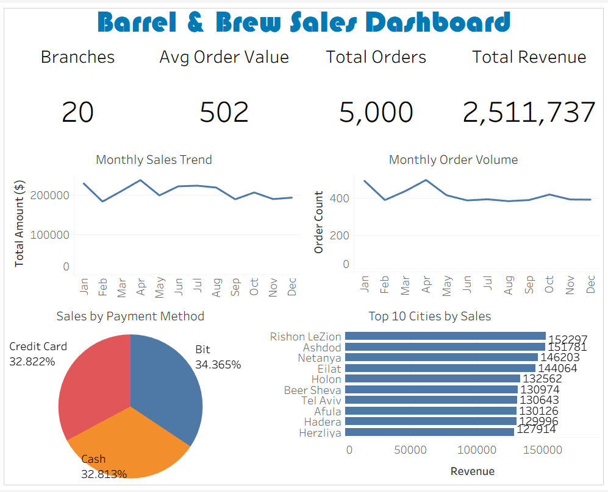
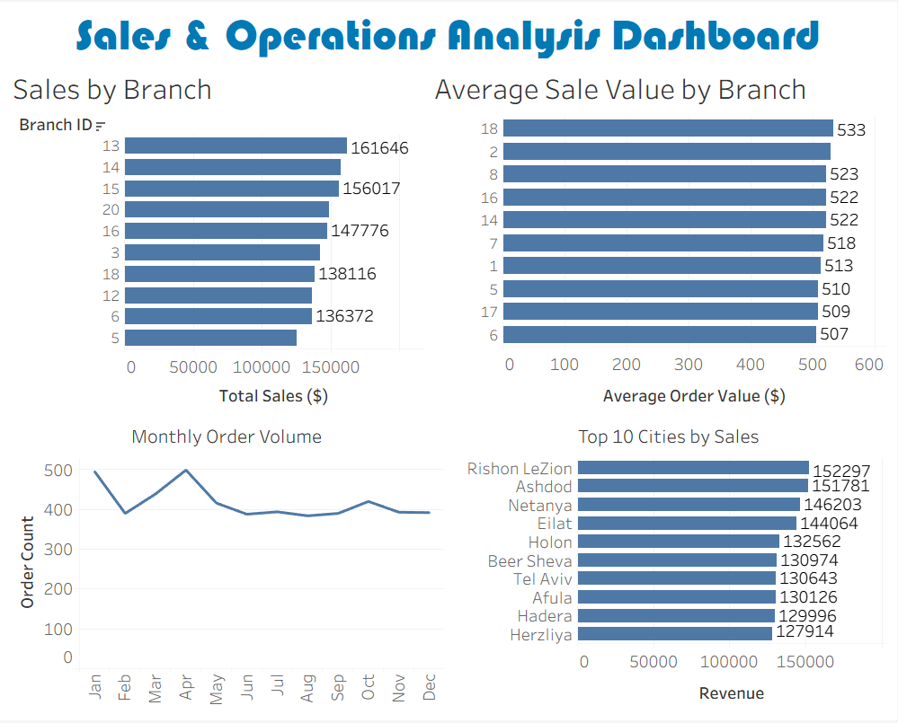
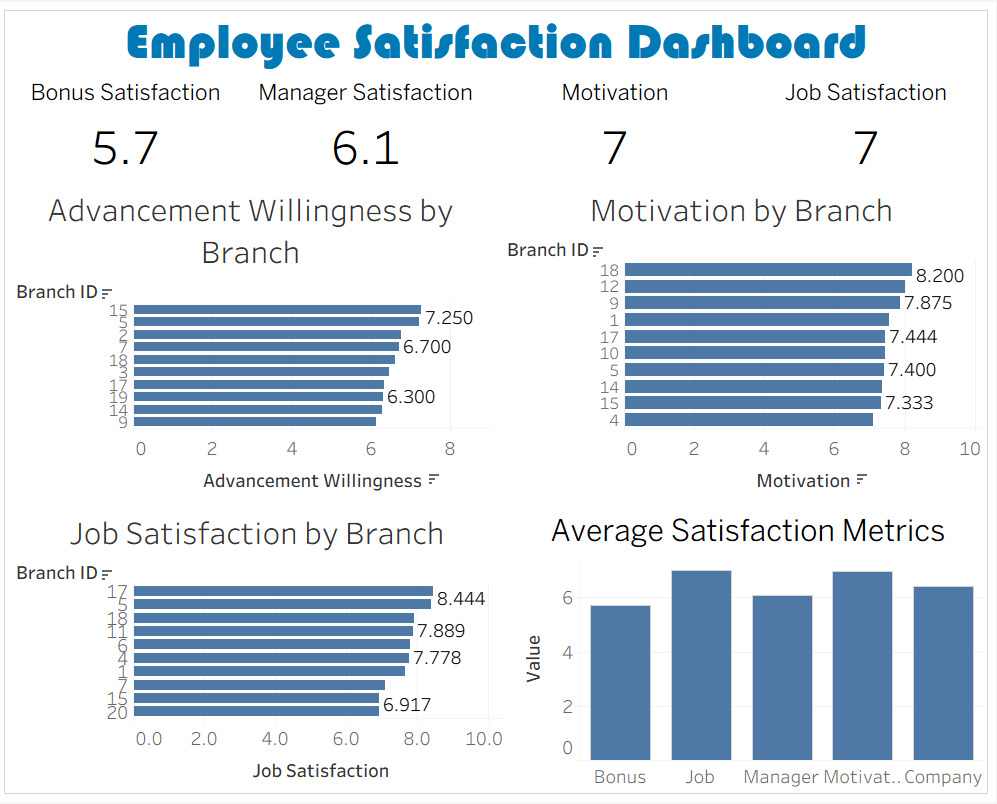

# Sales & Profitability BI Project
## Project Overview
This project was developed as part of a Business Intelligence course.
The objective was to analyze sales performance, profitability, branch performance and operational metrics in order to support data-driven business decisions.
## Tools Used
- Python
- Tableau
- Excel
## Project Process
- Data cleaning and preprocessing
- ETL process development
- Data modeling
- KPI definition and tracking
- Dashboard design and visualization
- Business insights generation
## Key Performance Indicators (KPIs)
- Total Revenue
- Total Profit
- Average Transaction Value
- Monthly Sales Trends
- Branch Performance Analysis
## Business Insights
The dashboard enables decision-makers to:
- Monitor sales and profitability trends
- Compare branch performance
- Identify top-performing products
- Support operational and strategic decision making
## Author
Elad Levin  
B.Sc. Industrial Engineering & Management  
Big Data Specialization  
Ruppin Academic Center

## Dashboard Gallery

The project includes three interactive dashboards focused on sales performance, operational analysis and employee satisfaction.

### Sales Dashboard

### Sales & Operations Analysis

### Employee Satisfaction Dashboard

